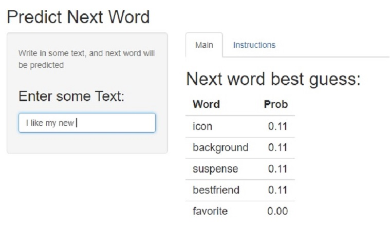
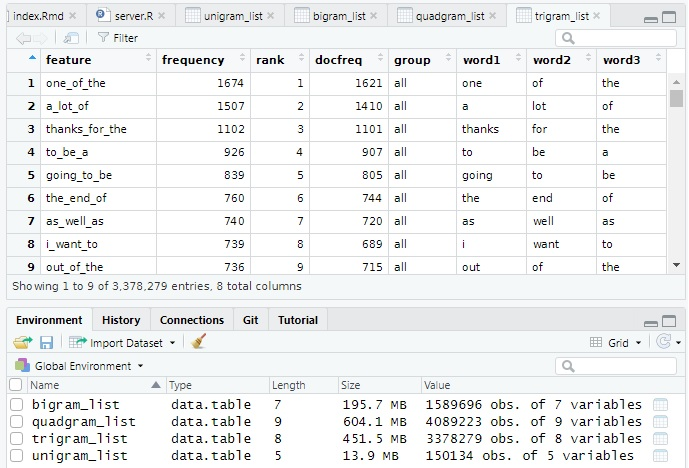

## Next Word Prection App

This app predicts next word of the text filled in by the user in the Input text box and returns best 5 calculated guesses.

<div style='text-align: center;'>
```{r, echo=FALSE, message=FALSE}
      library(knitr)
      
      
      
```    
</div>


The creation of the app is done in three steps:

    1.- Create N-gram files

    2.- Create the functions to calculate Kneser-Ney Smoothing recursive formula

    3.- Create the App to capture the text written by the user, apply the functions and show the five words with the biggest calculated probability

All programs and files needed to reproduce the App can be found in following **[GitHub repository](https://github.com/marroyopa/Data-Science-Capstone-Project)**


## Create the N-gram files

From the **[files](https://d396qusza40orc.cloudfront.net/dsscapstone/dataset/Coursera-SwiftKey.zip)** offered by the course, we've sampled 15% of the three files supplied (twitter, news & blog data).

Then, using quanteda package, we tokenized them all, removed numbers, spaces, punctuations, hypens, twitter symbols and profanity using a publicly maintained **[List of Dirty Naughty Obscene and Otherwise Bad Words](https://github.com/LDNOOBW/List-of-Dirty-Naughty-Obscene-and-Otherwise-Bad-Words/blob/master/en)**.

Then, this corpus has been the base to build our N-Gram files, from 4-Grams to Unigrams, giving its own column to each word of every N-Gram. This files have been saved as .Rda in the files directory, to be loaded by the App.

<div style='text-align: center;'>
```{r, echo=FALSE, message=FALSE}
      
      
      
```    
</div>

The code that creates the N-Gram files is contained in **01_Create_Data_Files.R** and can be found on the **[GitHub repository](https://github.com/marroyopa/Data-Science-Capstone-Project)** of the project.

## Kneser-Ney Smoothing Recursive Formula

To apply this formula, its sense and theory can be seen in this **[video](https://www.youtube.com/watch?v=cbAxvpBFyNU)** and one example of its application to 4-grams can be found in page 48 of **[Martin Christian Körner thesis](https://kola.opus.hbz-nrw.de/opus45-kola/frontdoor/deliver/index/docId/796/file/bachelor_thesis.pdf)**.

The formula is developed in **02_Functions.R** and can be found on the **[GitHub repository](https://github.com/marroyopa/Data-Science-Capstone-Project)** of the project.Steps followed are:

    1.- Candidate selection.- Based on the words introduced by the user and passed in the call to the function, search in 4-grams file with last 3 words for candidates. If there are less than 20 go to 3-grams, and so on until unigrams to complete a list of 20 candidate words.
    
    2.- Probability Calculation.- For each candidate, if there exists posibilities in the 4-grams using last 3 words introduced and the candidate, calculate bigram (with last word introduced and candidate), trigram (with last 2 words introduced and candidate) and quadgram probabilities (with 3 last words introduced and candidate). If only exists 3-grams for last 2 words, calculate bigram and trigram only. And so on, calculating only continuation probability in worst case working with unigram table in case is necessary.
    
    3.- Return Best Guess.- Order this candidates by probability descending and return first five to the main function together with their probability.
    
    4.- This function exists in 4-gram working with last 3 words introduced by the user, and in 3-gram and 2-gram in case user introduces only 2 or 1 word.

## NextWordPrediction App

### What App does?

**[NextwordPrediction App](https://marc-arroyo.shinyapps.io/NextWordPrediction/)** works as follows:

    1.- Checks the user input and if its blanks asks the user to introduce something. 
    
    2.- Since the first word, text introduced by the user is tokenized and treated as the base corpus was.
    
    3.- If there's only one word, 2-gram version of the function is called, if there are only two words, 3-gram version, and if there are 3 or more words introduced by the user, only last three are used to call 4-gram version of the Kneser-Ney recursive formula calculation.
    
    4.- The table returned by the function with 5 words and its calculated probabilties is printed.
    
    5.- There exists also an Instructions tab to help users if somebody is confused about what is happening in the app main tab.
    
### Future of the App?

**NextwordPrediction App** has two main problems that should be reworked:
    
    1.- The files are to big, even taking a smaller percentage of the corpus than initially planned. That turns the app to slow. This, clearly needs to be reworked.
    
    2.- The corpus is quite limited, and some common expresions have weird suggestions because of lack of vocabulary. This can be enriched increasing the corpus with other sources, but first point 1 has to be fixed.